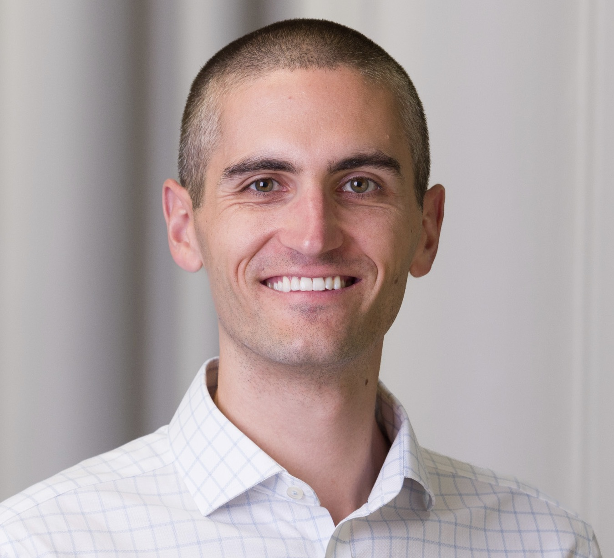
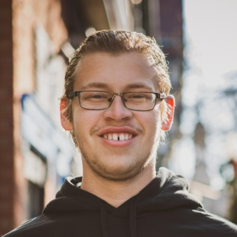
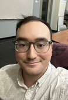
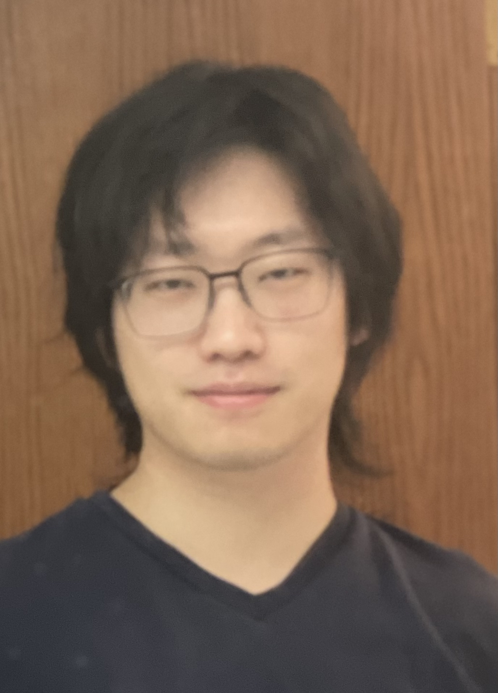
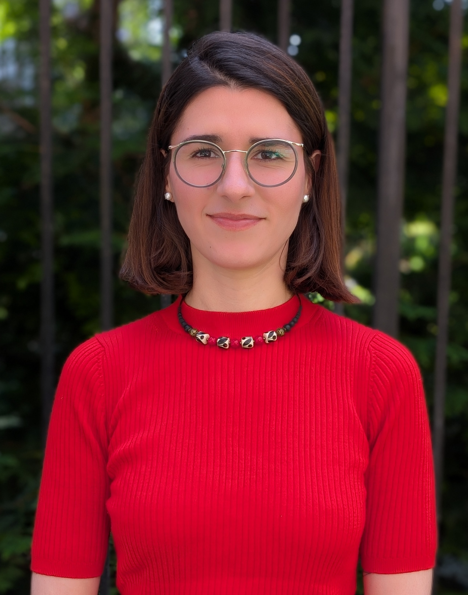
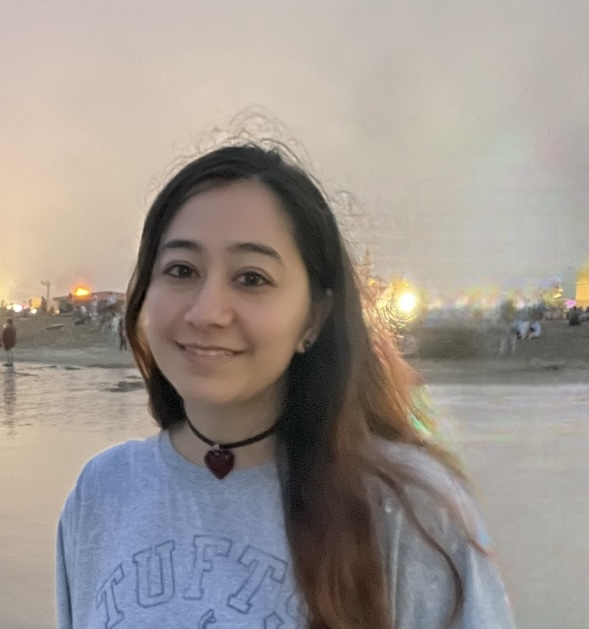
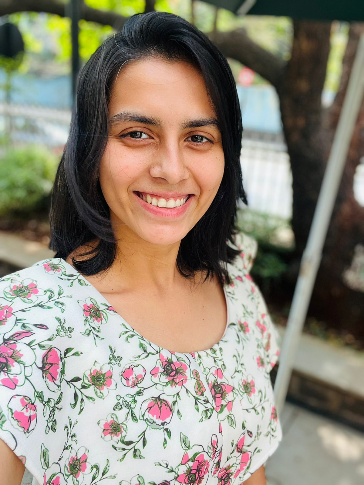

{width=600px fig-alt="New York CITTI logo"}

Welcome to the New York Climate Investigations: Theory To Impacts, a.k.a. New
York CITTI, research group. We seek end-to-end understanding of climate
processes, meaning from fundamental analytical theory to quantifying their
real-world impacts. We have two main research strands:

1. Monsoon rainfall. What controls when, where, and how intensely it rains
   within Earth's monsoon systems?
2. Weather and climate impacts on New York City.

---

## Group members

### Spencer Hill (Assistant Professor, CCNY EAS)

{width=270px fig-alt="Spencer Hill"}

My biggest passions are my wonderful family (wife, daughter, dog), science, and
music. I deeply love my adopted hometown of NYC. My favorite pizza in the city
(and therefore the world) is Lucali for whole pie and Bleecker Street Pizza for
slices. My favorite bagels in the city (and therefore the world) are Absolute
Bagel for a bagel w/ cream cheese and the original Russ & Daughters for a lox
sandwich.

---

### Alex Parsells (Ph.D. student, Columbia University DEES, group member since September 2022)

{width=270px fig-alt="Alex Parsells"}

Alex is a second-year Ph.D. student at Columbia University studying the
relationship between tropical rainfall and poleward energy transport. He has a
background in astrophysics and enjoys backpacking, trivia, and White Castle.

---

### Greg Randazzo (M.S. student, CCNY EAS, group member since August 2023)

{height=270px fig-alt="Greg Randazzo"}

Inspired by the 2023 Northeast wildfire season, I am currently working to
understand the influence of large scale synoptic features on the trajectory of
wildfire smoke plumes. In my free time I love learning foreign languages and
taking care of my plants. <https://dynamicplanet.net/>

---

### Haochang Luo (Postdoc, CCNY EAS, group member since April 2024)

{height=270px fig-alt="Haochang Luo"}

Haochang graduated from the University of Michigan with a PhD in Climate and
Space Sciences and Engineering. Most of his research focuses on tropical
dynamics. His research interests include convection, precipitation, tropical
meteorology, climate change, and multi-scale interactions.

---

### Edda Monique Hobuss (B.S. student, CCNY, group member since August 2024)

{height=270px fig-alt="Edda Hobuss"}

Edda began her academic journey in linguistics but transitioned to
physics. Although she has researched light-matter interaction in 2D materials,
she is excited about understanding the dynamic interactions of Earth's
atmosphere. In her free time, Edda enjoys spending time with her husband,
reading, and running, and visiting Gantry State Park for the Manhattan views
and the chicken and waffles from Sweet Chick.

---

### Michelle Wagner (M.S. student, CCNY EAS, group member since September 2024)

{height=270px fig-alt="Michelle Wagner"}

Michelle graduated from CCNY with a degree in Earth Systems Science. Her
research background includes satellite-based imaging applications for
environmental monitoring, characterization of phytoplankton bloom dynamics and
algorithm optimization for remote sensing data products that aid in HAB
detection. Through her EAS master's program, she is exploring atmospheric and
climate dynamics. She likes to sing and play music in her free time.

---

### Shreya Keshri (Postdoc, CCNY EAS, group member since February 2025)

{height=270px fig-alt="Shreya Keshri"}

I completed my Ph.D. in Atmospheric Science from IISER Pune, India. My research
focuses on the role of tropical-extratropical interactions in the genesis and
variability of synoptic-scale tropical motions and how they respond to climate
change. I am broadly interested in tropical meteorology, equatorial waves and
large-scale atmospheric dynamics. In my free time I like to cook, read, go for
a walk and spend time with my family.
